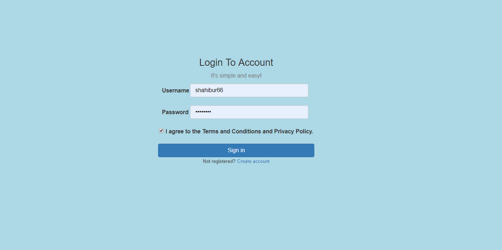
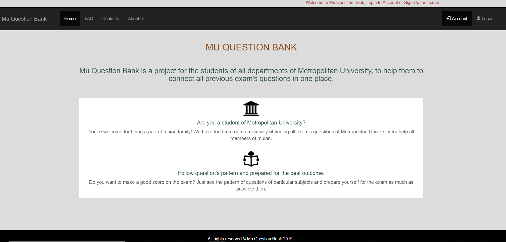
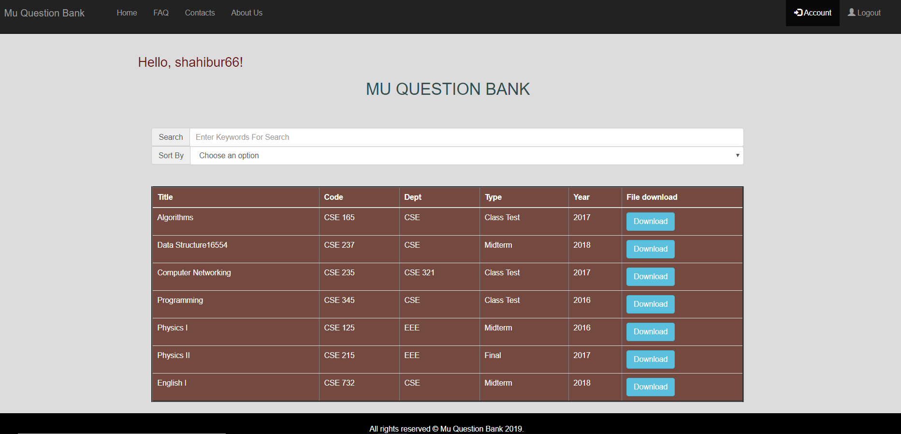
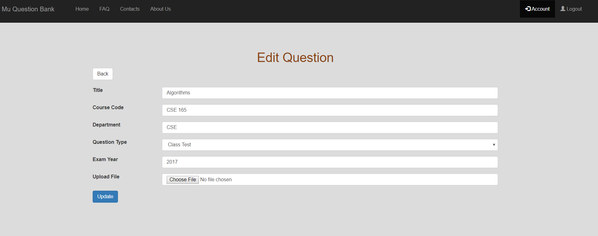

## MU Question Bank 

Web application using PHP and CodeIgniter Framework.

### Features

Admin interface consists of several features pointed as: 
*  Admin Login 
*  Admin Sign Up  
*  Add  Question To Database 
*  Update Question To Database
*  Delete Question From Database
*  Search  Question If Necessary
*  Download Question If Necessary

User interface consists of several features pointed as :
*  User Sign Up  
*  Search Question By Keywords
*  Search Question By Categories
*  Download Question If Necessary

### Demo

YouTube link : https://www.youtube.com/watch?v=Dy8Nks_QNvE

[User login page]

[Home page view]

[User dashboard view]

[Update page view]

### Tech Stacks

*  HTML, CSS, Bootstrap

*  PHP , MySQL (used for database)

*  JavaScript, JQuery

*  Ajax (used only for dynamic search)

*  Codeigniter (used for framework)
